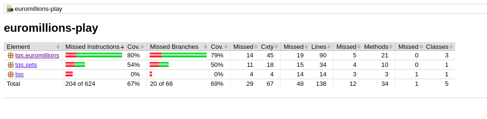
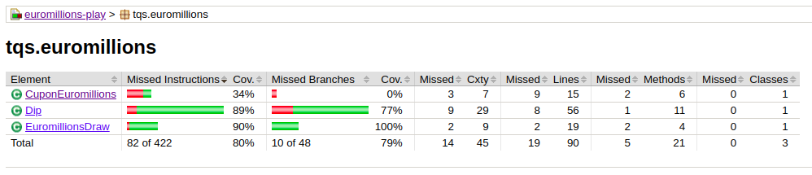
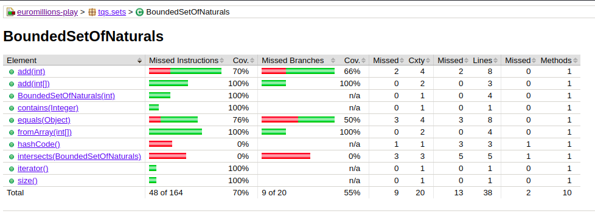
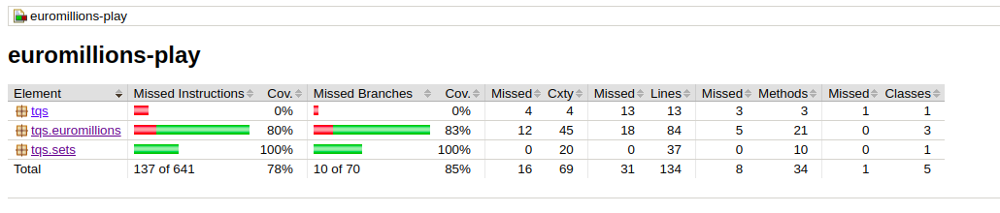
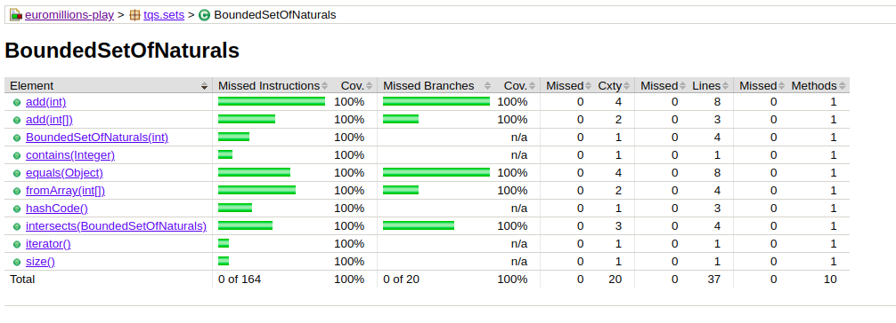

# Answers

### 2c/ Assess the coverage
#### Analyze the results accordingly. Which classes/methods offer less coverage? Are all possible [decision] branches being covered?

The CuponEuromillions class currently has the lowest test coverage at 34%. However, the untested methods, namely format() and countDips(), are not crucial to the class's core logic. Therefore, while not all possible branches are covered, the essential functionality is tested.

<!--  -->

To have more coverage I added some more test in BoundedSetOfNaturals class:

- Test add function with illegal arguments (maximum number of elements reached, duplicated elements, non natural elements, etc.)

- Test the fromArray method

- Test the Intersects method

- Test the hashCode method

- Test the equals method

### 2d/ Run Jacoco coverage analysis and compare with previous results. In particular, compare the “before” and “after” for the BoundedSetOfNaturals class.

Before

After

