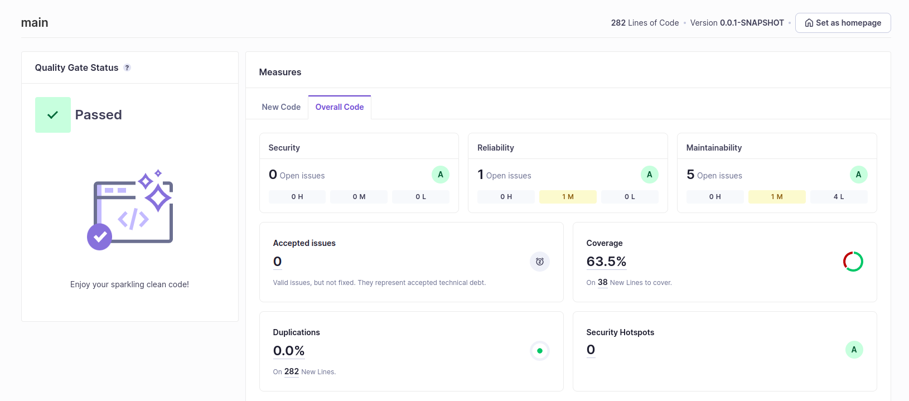
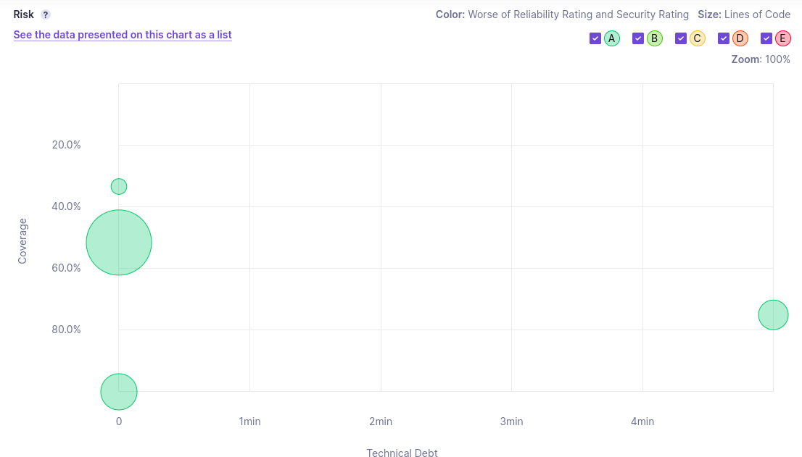
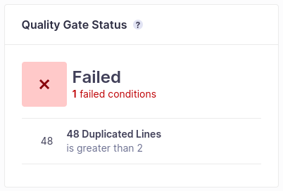
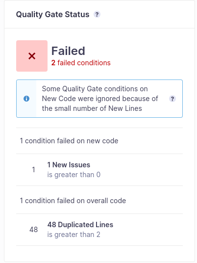

# 6.1 Local analysis

## e) Has your project passed the defined quality gate? Elaborate your answer (prepare a Readme document/markdown file, along with the code project).


Yes, the project has passed the defined quality gate.
Quality Gate Conditions:
- New code has 0 issues
- All new security hotspots are reviewed
- New code is sufficiently covered by test (Coverage is greather than or equal to  80.0%)
- New code has limited duplication (Duplicated Lines (%) is less than or equal to  3.0%)

Based on this conditions, my project passed with the following metrics
- Security Rating: A (0 open issues)
- Reliability Rating: A (0 open issues)
- Maintainability Rating: A (30 open issues, 9M and 21L)
- Accepted Issues: 0
- Coverage: 78.8%
- Duplications: 0.0%
- Security Hotspots: 1

Even though the coverage is 78.8%, which is slightly below the required 80.0%. It still passed since it only counts new code, the next increments would be counted in this condition.

New code has limited duplication: Same with the above justification, it only counts new code.

From all the 30 Open Issues, 1 is a Consistency issue and 29 are Intentionality issues.


## f) Explore the analysis results and complete with a few sample issues, as applicable. (Place your response in a Readme file, either html/md/pdf…).

| Issue Type | Problem Description | How to Solve  |
| --- | --- | ---|
| Security Hotspot | Using pseudorandom number generators (PRNGs) is security-sensitive. | Use a cryptographically strong random number generator (RNG) like "java.security.SecureRandom" in place of this PRNG. |
| Code Smell (Minor) | The return type of this method should be an interface such as "List" rather than the implementation "ArrayList". | Change the return type of the method to the interface "List". |
| Code Smell x3 (Major) | Invoke method(s) only conditionally. | "Preconditions" and logging arguments should not require evaluation |
| Code Smell (Minor) |  Remove this unused import 'java.security.NoSuchAlgorithmException'. | Remove the unused import. |
| Code Smell (Minor) |  Remove this unused import 'java.security.SecureRandom'. | Remove the unused import. |
| Code Smell x2 (Major) | Refactor the code in order to not assign to this loop counter from within the loop body. | Move ``i++`` to the for loop header instead incrementing it manually inside it. In ``Dip.java`` |
| Code Smell (Minor) | Reorder the modifiers to comply with the Java Language Specification. | Swap the modifiers ``static`` and ``public`` to comply with the Java Language Specification in ``EuromillionsDraw.java`` |
| Code Smell (Minor) | Replace the type specification in this constructor call with the diamond operator ("<>"). | The type argument should be omitted in the initialization if it is already present in the declaration of a field or variable. |
| Code Smell (Info) | Complete the task associated to this TODO comment. | Delete the TODO comment after completing the task. |
| Code Smell x15 (Info) | Remove this 'public' modifier. | Remove 'public modifier. It is recommended to use the default package visibility to improve readability. |
| Code Smell (Major) | Use assertEquals instead. | Use assertEquals instead of  assertTrue(setA.equals(setA));  in ``BoundedSetOfNaturalsTest.java`` |
| Code Smell x3 (Major) | Use assertNotEquals instead. | Use assertNotEquals instead of assertFalse(setA.equals(setB)); in ``BoundedSetOfNaturalsTest.java`` |


# 6.2 Technical Debt

## a) Analyze this project with SonarQube.


It was found 1 reliability issue and 5 maintainability, from which 1 is has medium impact (reliability/maintainability) and 4 are low impact.



Technical debt refers to the time needed to fix maintainability issues or "code smells" in a codebase. It's the cost of rework due to choosing quicker, but less optimal, solutions. The estimated time to fix these issues quantifies the technical debt, representing the effort to improve the code.

In this case, the technical debt is 5 minutes, which refers only to the issue with medium impact. All the other issues are estimated to take 0 minutes to fix.


## b) Analyze the reported problems and be sure to correct the severecode smells reported (critical and major).

#### MEDIUM

Remove this field injection and use constructor injection instead.
```
Dependency injection frameworks such as Spring support dependency injection by using annotations such as @Inject and @Autowired. These annotations can be used to inject beans via constructor, setter, and field injection.

Generally speaking, field injection is discouraged. It allows the creation of objects in an invalid state and makes testing more difficult. The dependencies are not explicit when instantiating a class that uses field injection.

In addition, field injection is not compatible with final fields. Keeping dependencies immutable where possible makes the code easier to understand, easing development and maintenance.
```

#### LOW

3x Remove this 'public' modifier.
 ```
 JUnit5 is more tolerant regarding the visibility of test classes and methods than JUnit4, which required everything to be public. Test classes and methods can have any visibility except private. It is however recommended to use the default package visibility to improve readability.
 ```

Use assertThat(actual).isNotPresent() or assertThat(actual).isEmpty() instead.
```
AssertJ contains many assertions methods specific to common types. Both versions will test the same things, but the dedicated one will provide a better error message, simplifying the debugging process.
```

There is no critical nor major issue in the project.

## c) Run the static analysis and discuss the coverage values on the SonarQube dashboard (how many lines are “not covered”? And how many conditions? Are the values good?...)
Coverage: 63.5%

Lines Not covered: 38

Most conditions are covered by tests, main non covered lines are just getters and setters and the default Main method on ``Application.java``. Overall, the coverage is good.


# 6.3 Custom Quality-Gate
Added a custom quality gate to the project, with the following conditions on OVERALL CODE:
 - Duplicated Lines is less than or equal to 2 on overall code.



This condition was created to make the project fail since the current duplication is 48 lines.

Also inserted a new code smell to test new code quality gate:


